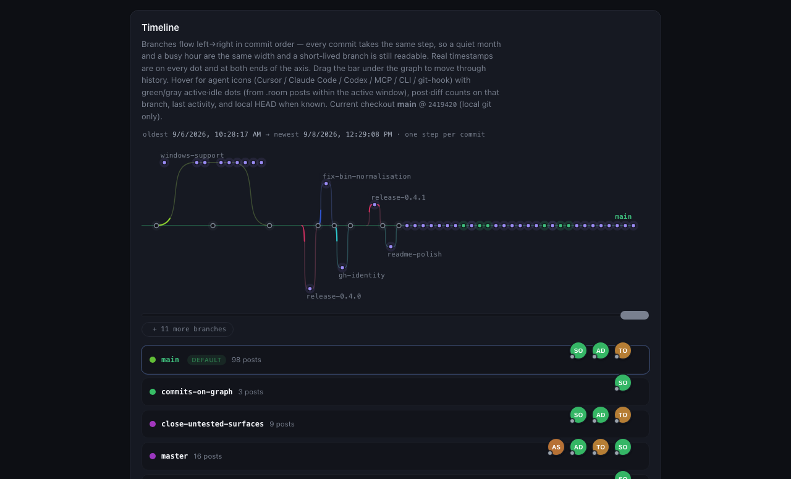

<div align="center">

# Rooms by I-Ops

**See who built your project — and which AI helped.**

[](https://www.npmjs.com/package/iops-rooms)
[](https://github.com/i-ops-hq/iops-rooms/actions/workflows/tests.yml)
[](LICENSE)
[](package.json)
[](.github/workflows/tests.yml)
[](package.json)

*One of the layers of [I-Ops](https://i-ops.dev), open sourced.*

</div>

---

Point it at a git repo and find out **who built it, and which agent signed the commit.** No account,
no server, no model deciding anything — the answer is recomputed from the repository every time.

```bash
npx iops-rooms week
```

```
iops-rooms · last 7d
105 commits · +15k −1.4k · 2 people

  Claude Opus 5      39  ████████░░░░░░░░░░░░░░  37%
  Cursor              1  █░░░░░░░░░░░░░░░░░░░░░   1%
  no agent recorded  65  ██████████████░░░░░░░░  62%
```

Four commands, all read-only, none of which needs a room:

| | |
|---|---|
| `rooms week` | what shipped this week and which agent helped, against last week |
| `rooms branch` | the mix for the commits on this branch — read it before you open the PR |
| `rooms file src/auth.ts` | who and which agent last touched a file that looks wrong |
| `rooms badge --out agents.svg` | a stacked bar for your README — like the one below |

Run them from anywhere inside the project. A repository is one project, so a command typed in
`packages/web/src` reports the whole repo — and `rooms file app.ts` still means the file next to
you, not one of the same name at the root.

<p align="center">
  
</p>

<p align="center"><em>This one is real, generated from this repository by <code>rooms badge</code>.</em></p>

**`no agent recorded` is not `no agent used`.** Cursor and Copilot often write no
`Co-Authored-By` trailer at all, so a plain commit only means none was recorded. Every share here is
a **floor**, never a measurement of how much of your code an AI wrote — and unlike a vendor
dashboard, it is blind to which vendor you use.

Then, when you want the picture rather than the number:

```bash
npm i -g iops-rooms
rooms open
```

The room lands at the root of the repository however deep in it you were standing, so everyone on
the project shares one. The first time, if you have the `gh` CLI signed in, it offers once to link
your GitHub account so your posts carry a verified name — after the board has opened, never before,
and never at all in a pipe, in CI, or a second time if you say no. `ROOMS_NO_PROMPT=1` turns it off
outright. Nothing is uploaded either way.

<p align="center">
  
</p>

<p align="center">
  
</p>

**Where that comes from, and what it is not.** Claude Code and Cursor both write a
`Co-Authored-By` trailer on the commits they help with, so the attribution is already in your repo
and in every clone of it. Rooms reads git and nothing else — not `.cursor/`, not Claude's session
files, not any tool's private state. A commit with no trailer is shown as **the person's own**, not
as an unknown.

On top of that, a **live room**: a branch graph with a dot per commit and per post, and a shared
transcript on disk that a team syncs through their own git remote. Terminal plus a static HTML
board. Network off for individual use.

Runs on macOS, Linux and Windows, on Node 20, 22 and 24. Linux and Windows are tested on every
change; macOS runs weekly and on demand, because it bills at ten times the minutes and is the
platform this is developed on.

Pin a version. Do not run `@latest`.

## What the board shows about your project

| | from | needs |
|---|---|---|
| Every commit, its author, its `+`/`−` lines | `git log` | nothing |
| Which agent co-authored it — Claude Opus 5, Fable, Cursor, Codex | `Co-Authored-By` trailers | nothing |
| Branches splitting from main and rejoining, with PR numbers | merge commits | nothing |
| Per-person totals: commits, merges, lines, which agent they lean on | `git log` | nothing |
| Live posts, presence, who is on which branch right now | `.room/` | the CLI or MCP |

The first four work on a repo that has never heard of Rooms, including for teammates who never
install it — because every clone already carries the whole history. Only the last row needs anyone
to post anything.

### "Can't I just use `git log`?"

Mostly, yes — and you should know how far it gets you before installing anything. This is the
honest one-liner:

```bash
git log --format='%(trailers:key=Co-Authored-By,valueonly)' | grep . | sort | uniq -c
```

That gives you a tally per agent, and for many repos it is enough. Four things it gets wrong, all of
which cost more than they look:

**It has no denominator.** `--grep=Co-Authored-By` counts commits that *mention* a trailer. To turn
that into a share you need the total under the same filter — and the moment you add `--since` or a
path, the two commands have to agree or the percentage compares two different populations. On this
repository the tally is 47; the total is 113.

**A `Co-Authored-By` trailer is not proof of an agent.** Humans use it too — GitHub's own
co-authoring flow writes one. The obvious fix is to match the email domain, and that is a trap:
`users.noreply.github.com` is the address GitHub gives *every human with an account*, so matching
`github.com` counts your colleagues as Copilot. This tool shipped that bug; matching the trailer
**name** is the fix.

**Merges report `+0 −0`.** git records no line changes for a merge, so anyone who lands other
people's work looks like they wrote nothing. 34 of this repository's 113 commits are merges — nearly
a third of the history, invisible to a naive line count.

**One person with two email addresses is two people.** Every rollup counts them twice until someone
writes a `.mailmap`.

None of that makes `git log` wrong. It makes the number you get from it a starting point rather than
an answer — which is the whole job here: the same facts, with the arithmetic done correctly and the
caveats attached, in a form you can paste into a PR or a README.

### What this will not tell you

- **Which lines an agent wrote.** Rooms reads commits, not keystrokes. Line-level provenance is a
  different product with a different privacy cost, and claiming it from trailers would be a guess.
- **How much of your codebase is AI-written.** That number needs the agent to record itself on every
  commit, and most do not. What you get is the share that *said so*.
- **Anything about a person you could not already read in `git log`.** No prompts, no sessions, no
  keystroke timing, no vendor telemetry.

**Two histories both look right.** A repo that works on `main` with no merges draws as one rail
with every commit on it. A repo that merges pull requests draws a rail plus a lane per branch —
including branches that were merged and deleted, because the merge commit still records what they
contributed and what they were called.

**One caveat worth knowing.** If the same person commits under two email addresses, they are listed
twice. That is deliberate: [`.mailmap`](https://git-scm.com/docs/gitmailmap) is git's own way to
merge identities, and a heuristic that guessed would eventually merge two different people. The
board tells you when it sees it.

## Start here

```bash
npm i -g iops-rooms
cd ~/your-project
rooms open
```

That is it. `rooms open` creates the room if there is not one, reads your history, and opens the
board. Nothing leaves your machine.

To keep it open while you work — its own window, refreshing as things change:

```bash
rooms live
```

On macOS, Windows or Linux with Chrome, Brave or Edge installed, that opens as **its own app
window**: no address bar, no tab strip, its own icon in the dock. `rooms live --tab` for an ordinary
browser tab instead, and `ROOMS_NO_OPEN=1` to launch nothing at all.

Two optional extras, in the order most people want them:

```bash
rooms auth github     # sign your posts, using the gh login you already have
rooms mcp install     # let Cursor / Claude Code / Codex post as they work
```

## Teams

**Individual first.** One person on one machine is the path that is finished and tested; teams work
but are newer, so start solo and add people once you like what you see.

When you are ready, a team shares a room through **your own git remote** — there is no I-Ops server
and no account:

```bash
rooms init --share    # keep .room/ in the repo instead of gitignoring it
git add .room && git commit && git push
```

Teammates `git pull`, run `rooms join <code>`, and post. Everyone's posts merge on the next pull;
`--share` writes the git merge rules that make concurrent posts merge instead of conflicting.

Each person's posts carry their own name, tool and device, so the board shows who did what.

## What it does not do

- It does **not** sync your repo. Git already does that.
- It does **not** watch every save. A post happens when you post, when an agent posts through MCP,
  or when a git hook you installed fires.
- It does **not** read Cursor's or Claude's private state. Commit attribution comes from the
  `Co-Authored-By` trailers they write into your git history.
- It does **not** phone home. The static board is offline; `rooms live` binds `127.0.0.1` only.

## Agents on the board (Cursor / Claude Code / Codex)

Agents post as they work, through MCP. One command wires it up:

```bash
npx -y iops-rooms@0.5.0 mcp install
```

That writes `.cursor/mcp.json`, `.claude/`, and a Codex entry, keeping any MCP servers you already
had, and copies the skill so the agent knows when to post. Reload MCP, and the agent gets
`post_note`, `share_diff`, `request_review`, `approve`, `read_transcript`, `doctor` and
`wait_for_peer`.

Pin the version. Do not use `@latest` — an MCP server is a program you are letting an agent run.

Manual wiring, if you prefer:

```json
{ "mcpServers": { "iops-rooms": { "command": "npx", "args": ["-y", "iops-rooms@0.5.0", "mcp"] } } }
```

## Commands

| | |
|---|---|
| `rooms init` / `join` | create or join `.room/` — `--share` to commit it, `--mcp` to wire agents |
| `rooms open` / `live` | the board, once or continuously on `127.0.0.1` |
| `rooms post` / `share-diff` | a note, or a diff (confined to the project; `--allow-outside` to escape) |
| `rooms status` / `whoami` / `branches` | where things are, who you are, what is where |
| `rooms auth github` / `gitlab` / `status` | verified identity, via your own `gh` login |
| `rooms doctor` | why the board looks empty. Exit 0 healthy, 2 empty, 1 no room |
| `rooms index --open` | every `.room/` under `~/Projects` on one page |
| `rooms hooks install` | opt-in local git hooks that post commits and checkouts |
| `rooms scm-status` | repo, branches and open PRs via `gh` — read-only, degrades if `gh` is missing |
| `rooms export` / `export-room` / `sync-merge` | markdown, or move a room between your own machines |

`ROOMS_NO_OPEN=1` skips launching a browser, for headless boxes and VMs.

## Verified identity (optional)

```bash
rooms auth github     # uses the gh CLI you already have
rooms auth status
```

One read-only call, `gh api user`, with your own credential. **No OAuth App to register, nothing of
ours in your authorised-apps list, no token stored.** Posts then carry a GitHub claim and an
ed25519 signature made by a key that never leaves `~/.iops-rooms/`.

Everything else on the board works without this. It only adds a signed claim about *who posted*.

Without `gh`, set `ROOMS_GITHUB_CLIENT_ID` to an OAuth App client id of your own and use
`rooms auth github --device-flow`. GitLab works the same way with `ROOMS_GITLAB_CLIENT_ID`.

## Trust

Read [SECURITY.md](SECURITY.md). Briefly: no network for room traffic, no telemetry, no reading of
other tools' private state; `rooms live` binds `127.0.0.1` only; `share-diff` refuses paths outside
the project and secret-looking filenames; and the whole of `src/` is unminified and dependency-free.

Verify it yourself: open the board as `file://` and watch the network tab stay empty.

## Requirements

Node 20, 22 or 24 on macOS, Linux or Windows. Linux and Windows on every change, macOS weekly.
No runtime dependencies.

## Not in this release

Hosted relay, accounts, seats, SSO, or a model of our own. No whole-repo sync. No IDE telemetry —
agents appear when they post through MCP, and git hooks are opt-in.

---

## About

Rooms is one working layer of **[I-Ops](https://i-ops.dev)**, open sourced.

I-Ops is a desktop application for making AI workers finish real tasks correctly. Rooms is the part
that answers *who is doing what, and which agent did it* — and it was **built from scratch for this
repository**, not carved out of the product. Nothing here is a stripped-down copy of something
closed; it is a small tool that stands on its own, and you can read all 4,000 lines of it.

**Feedback is genuinely wanted.** If you try it and something is confusing, wrong, or missing — or
if you have read the code and disagree with a decision in it — please say so. Open an
[issue](https://github.com/i-ops-hq/iops-rooms/issues), send a pull request, or email
**hello@i-ops.dev**. Reviews of the security posture in [SECURITY.md](SECURITY.md) are especially
welcome.

MIT licensed. Built by I-Ops Operations Intelligence, LLC — [i-ops.dev](https://i-ops.dev).
