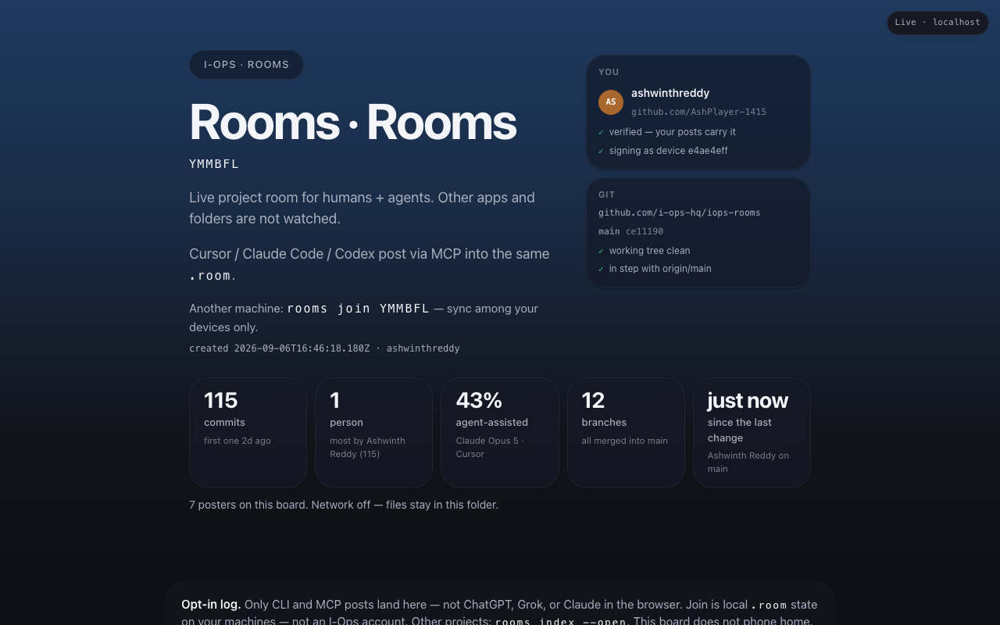
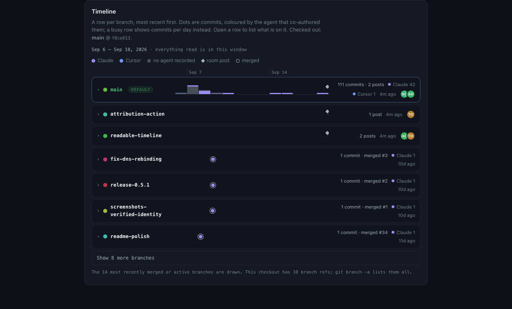

<div align="center">

# Rooms by I-Ops

**See who built your project and which AI helped. Share your team's status and AI setups through your own GitHub.**

[](https://www.npmjs.com/package/iops-rooms)
[](https://github.com/i-ops-hq/iops-rooms/actions/workflows/tests.yml)
[](LICENSE)
[](package.json)
[](.github/workflows/tests.yml)
[](package.json)

*One of the layers of [I-Ops](https://i-ops.dev), open sourced.*

</div>

---

Rooms works from your own machine and your own GitHub: no account, no I-Ops server, and no model
deciding anything. It does three things.

- **Who built a project, and which AI helped.** Point it at a git repository and it reads the
  history: which agent signed which commit, recomputed from the repository every time.
- **A team room.** A private repository your team owns holds each member's status: work not yet
  committed, pull requests and agent sessions, on a board everyone can open.
  [More below.](#a-team-room-through-your-own-github)
- **Shared AI setups.** Export your Claude Code, Codex or Cursor setup for a role. A teammate adopts
  it with a plan they approve first, and can put every byte back.
  [More below.](#setups-share-a-claude-code-codex-or-cursor-setup-and-adopt-a-teammates)

The first needs nothing but a repository:

```bash
npx iops-rooms week
```

```
Claude co-authored 68 of the last 137 commits here, and Cursor 1.

i-ops-hq/iops-rooms · last 90d
137 commits · +21k −2.4k · 1 person

  Claude             68  ███████████░░░░░░░░░░░  49%
  Cursor              1  █░░░░░░░░░░░░░░░░░░░░░   2%
  no agent recorded  68  ███████████░░░░░░░░░░░  49%

"no agent recorded" is not "no agent used". Cursor and Copilot often write
no Co-Authored-By trailer, so a plain commit only means none was recorded.
Every share here is a floor.

Configured for: Cursor (.cursor/).
A config file says a tool was set up here, never that it was used — and
never how much. These are not commits and do not belong in the percentages
above.
```

That is this repository, which is unusually well attributed because it is built by an agent that
writes the trailer. **Most repositories look nothing like it.** Here is `anthropic-sdk-python`, and
it is the more honest picture of what you should expect on a first run:

```
Claude co-authored 35 of the last 500 commits here.

anthropics/anthropic-sdk-python · last 3650d
500 commits · +165k −31k · 35 people

  Claude                                        35  ██░░░░░░░░░░░░░░░░░░░░   7%
    Claude                                      31
    Claude Code                                  1
    Claude Opus 4.6                              1
    Claude Opus 4.7                              1
    and 1 more                                   1
  co-author that says it is a bot                5  █░░░░░░░░░░░░░░░░░░░░░   1%
  co-author, no bot marker — usually a person    7  █░░░░░░░░░░░░░░░░░░░░░   1%
  no agent recorded                            453  ████████████████████░░  91%

Reading the newest 500 of 1423 commits in this window.

"no agent recorded" is not "no agent used". Cursor and Copilot often write
no Co-Authored-By trailer, so a plain commit only means none was recorded.
Every share here is a floor.

Configured for: Claude Code (CLAUDE.md).
A config file says a tool was set up here, never that it was used — and
never how much. These are not commits and do not belong in the percentages
above.
```

Six percent, in the repository of the company whose tool writes the trailer by default. Across six
well-known repositories — Anthropic's, OpenAI's, LangChain's, Astral's, Vercel's and tinygrad's —
1.5% of 3,000 commits carried a trailer this could attribute. **If your repository comes back
mostly `no agent recorded`, that is the normal result and not a fault in your history.** The
number is a floor, and on most repositories it is a very low one.

Four commands, all read-only, none of which needs a room:

| | |
|---|---|
| `rooms week` | what shipped this week and which agent helped, against last week |
| `rooms branch` | the mix for the commits on this branch — read it before you open the PR |
| `rooms file src/auth.ts` | who and which agent last touched a file that looks wrong |
| `rooms badge --out agents.svg` | a stacked bar for your README — like the one below |

Run them from anywhere inside the project. A repository is one project, so a command typed in
`packages/web/src` reports the whole repo — and `rooms file app.ts` still means the file next to
you, not one of the same name at the root.

On a branch other than the default one, `rooms week`, `rooms badge` and the board read the default
branch's history: `origin/main` as your last `git fetch` left it, or your own `main` without a
remote. Rooms never switches your checkout. A last line says what your branch adds, and `rooms
branch` shows those commits. Reports and the board name the project as its remote does, `owner/repo`.

Not sure where to start? Type `rooms` on its own, in any folder: it says what it found there, a
project on some branch, a folder without git, or a folder of projects, and the few commands that
fit. `rooms help` lists them all.

<p align="center">
  
</p>

<p align="center"><em>This one is real, generated from this repository by <code>rooms badge</code>.</em></p>

**`no agent recorded` is not `no agent used`.** Cursor and Copilot often write no
`Co-Authored-By` trailer at all, so a plain commit only means none was recorded. Every share here is
a **floor**, never a measurement of how much of your code an AI wrote — and unlike a vendor
dashboard, it is blind to which vendor you use.

**A trailer this tool does not recognise gets its own row** rather than being folded into
`no agent recorded`. Ten agents are recognised by name today — Claude, Cursor, Codex, Copilot,
Devin, Gemini, Jules, aider, Amazon Q, Windsurf — and the eleventh appears in that row instead of
quietly lowering the floor.

**There are two such rows, and neither of them says "agent".** Until 0.5.7 there was one, labelled
`co-author, not a known agent`, and on `astral-sh/uv` it read 47% with a long bar sitting directly
above `no agent recorded` — so the page said, to any eye scanning it, that half the repository was
agent-written. Inside that row were Zanie Blue with 157 commits, Charlie Marsh with 14, and a
handful of release bots. Not one AI agent in the top twelve. The label was true and the number read
as something else, which is the failure this tool exists to refuse.

They are split on `[bot]`, which GitHub appends to every App account, so it is the platform's own
marker rather than a guess about anybody's name. A release bot that does not mark itself lands with
the people — that understates automation instead of overstating it, and calling somebody's
colleague a robot is the more expensive mistake.

**One row per agent; the model goes underneath it.** `anthropic-sdk-python` reported Claude Code
five separate times — `Claude`, `Claude Opus 4.6`, `Claude Opus 4.7`, `Claude Opus 4.7 (1M context)`
and, from a hook that wrote its template instead of its value, `Claude Code (${CLAUDE_PROJECT_DIR})`
— so the one agent anybody was looking for never appeared as a number. The agent and the model are
two different questions; the row answers the first and the lines beneath it answer the second.

**Counts can overlap; percentages cannot.** A commit with two agents on it appears in both of their
counts, because both of them were there. The percentages split that commit evenly so the rows always
total 100, and the output says how many commits were split.

Then, when you want the picture rather than the number:

```bash
npm i -g iops-rooms
rooms open
```

The room lands at the root of the repository however deep in it you were standing, so everyone on
the project shares one, and every worktree of it shares the main checkout's. Run it in the folder
that holds your repositories and it names them rather than making a room there. If git cannot read
the project, the board says why, in git's own words. The first time, if you have the `gh` CLI
signed in, it offers once to link your GitHub account so your posts carry a verified name — after the
board has opened, never before, and never at all in a pipe, in CI, or a second time if you say no.
`ROOMS_NO_PROMPT=1` turns it off outright. Nothing is uploaded either way.

<p align="center">
  
</p>

<p align="center">
  
</p>

**Where that comes from, and what it is not.** Claude Code and Cursor both write a
`Co-Authored-By` trailer on the commits they help with, so the attribution is already in your repo
and in every clone of it. Rooms reads git and nothing else — not `.cursor/`, not Claude's session
files, not any tool's private state. A commit with no trailer is shown as **the person's own**, not
as an unknown.

On top of that, a **live room**: a timeline with a row per branch and one zoomable time axis, a
dot per commit and per post that opens into a list, and a shared transcript on disk that a team
syncs through their own git remote. Terminal plus a static HTML
board. Network off for individual use.

Runs on macOS, Linux and Windows, on Node 20, 22 and 24. Linux and Windows are tested on every
change; macOS runs weekly and on demand, because it bills at ten times the minutes and is the
platform this is developed on.

Pin a version. Do not run `@latest`.

## What the board shows about your project

| | from | needs |
|---|---|---|
| Every commit, its author, its `+`/`−` lines | `git log` | nothing |
| Which agent co-authored it — Claude Opus 5, Fable, Cursor, Codex | `Co-Authored-By` trailers | nothing |
| Branches splitting from main and rejoining, with PR numbers | merge commits | nothing |
| Per-person totals: commits, merges, lines, which agent they lean on | `git log` | nothing |
| The last 7 days as `rooms week` prints them: the finding, the rows, every caveat | `git log` | nothing |
| Each agent session on this machine: its model, the files it edited, the commits that carry them | the agents' own hooks | `rooms hooks install --agent claude-code` |
| This checkout right now: what is not committed, its upstream, its pull request | `git`, and your own `gh` for the pull request | `gh` signed in, for the pull request |
| Live posts, presence, who is on which branch right now | `.room/` | the CLI or MCP |

The first five work on a repo that has never heard of Rooms, including for teammates who never
install it — because every clone already carries the whole history. The week is built from the same
report as `rooms week`, with the same sentences, so a teammate who never opens a terminal reads
what the terminal says, in the board's own window. Agent sessions need the hooks, the pull request
needs your own `gh` signed in, and live posts need someone to post. An open `rooms live` board
updates as an agent edits.

Every `rooms week` ends with the checkout as it stands, in the words the board's Git card uses:

```
Right now, in this checkout (now/right-now):
  uncommitted: +38 −5 in 3 files, and 1 new file
  this branch tracks nothing yet
  not pushed yet, so no pull request
```

Counts only, never which files. The pull request is asked of GitHub through your own `gh`, only
for a branch your remote already has, at most once a minute per branch and never on the default
branch. A branch only on your machine reads "not pushed yet", and its name goes nowhere. "No pull
request yet" means GitHub said so; anything short of that reads "pull request unknown", with the
reason. `ROOMS_NO_GH=1` turns the question off.

### A team room, through your own GitHub

When several people work on a project, each one's Rooms can share a small status with the others
through a private repository the team owns. Nothing goes through an I-Ops server.

```bash
rooms team init --name acme       # once, in a clone of a new private repository; then git push
rooms team join acme/team-room    # in each project, on each member's machine
rooms team sync                   # shows your status and asks before the first push
rooms team board                  # everyone's status, in its own window
rooms team live                   # the same board, kept current while it is open
rooms team workflow               # once, in the team room: BOARD.md, for people who only read GitHub
```

A status holds the project; if you share it, the branch and its upstream; how far it is ahead or
behind; its pull request's state; what is not committed yet, as counts of files and lines; and how
many agent sessions your hooks saw in the last seven days. Never a file name, a line of code, a
commit message or a prompt. `--no-branch` leaves the branch out, and `--dry-run` shows the file
without sharing it. Rooms pushes only your own status file, one per project, with your own git, and
only after you have seen it and said yes; an unchanged status is not pushed again.

`rooms team live` keeps the board current while its window is open: every five minutes (`--every`,
thirty seconds at the least) it fetches the team room with git, which asks nothing of GitHub's API,
and the page says when it last looked. If you have already shared once with `rooms team sync`, it
also shares your status for this project when it changes; `--no-share` keeps it read-only. It runs
only while it is open, with nothing left running in the background.

For people who read the team room on GitHub and run nothing, `rooms team workflow` adds a GitHub
Action that rebuilds `BOARD.md` from the status files every hour (`--hours`) and on demand. GitHub
shows it only to people who can read the repository, so a stakeholder needs read access and nothing
else. The Action runs an exact version of Rooms, may only write the repository, and commits
`BOARD.md` only when a status changed; it tells you what it costs in Actions minutes before you add
it. Pushing it needs a login that may change workflows (`gh auth refresh -s workflow`).

A team room on GitHub must be private. Rooms asks GitHub through your own `gh` on every sync, and
refuses a public one unless you pass `--public`; where it cannot ask, you confirm with
`--confirm-private`. The board is built on each viewer's machine rather than published, because
GitHub Pages serves a site to the whole internet on every plan except Enterprise Cloud. Anyone who
can write to the team room can write any file in it, so a status is as trustworthy as that access.

### Setups: share a Claude Code, Codex or Cursor setup, and adopt a teammate's

A setup is how someone has Claude Code, Codex or Cursor set up for a kind of work: their `CLAUDE.md`,
`AGENTS.md` or Cursor rules, agents, commands, skills, prompts, hooks, permission rules, model and
sandbox settings, and MCP servers. The team room holds them, one folder per setup, reviewed like any other change.

```bash
rooms setup export --role backend --name go-claude   # in your project; shows it all, then commits to a branch
rooms setup show                                     # every setup in the team room
rooms setup show backend/go-claude                   # what it holds, runs and needs, and who added each part
rooms setup adopt backend/go-claude                  # a plan first; nothing changes until you approve it
rooms setup rollback                                 # every file back as it was
rooms setup status                                   # what you adopted here, and whether there is newer
```

Export reads only what it lists: the project's Claude Code, Codex and Cursor files, and yours from
`~/.claude`, `~/.codex`, `~/.agents/skills` and `~/.cursor` with `--user` (`--tool cursor` takes one
tool only). Of a Codex config it takes the servers, and with `--user` the model, approvals, sandbox and
`notify`; never a project's trust entry, an environment value, or `danger-full-access`. Of Cursor's it
takes the servers, hooks and permission rules; never its approval mode or sandbox, or a `Shell` rule
that lets any command run. It replaces every environment value and header with a placeholder, refuses a file holding
something that looks like a secret or a path in your home or to the project's own folder, and refuses
launchers without an exact version. It commits to the branch `setup/<role>/<name>` in your clone of the team room and pushes
nothing: you push it and open a pull request. `--summary` says what it is for, and `--cost "20 Claude
Pro"` what it costs a month, which is shown as declared, never measured.

Adopting shows a plan: every file it would write or replace, every settings change, everything that
would run on your machine and who added it, and what Claude could then do without asking. You approve
it at a terminal, or with `--approve` and the digest the plan printed; `--yes` is never enough. Settings
merge into your `.claude/settings.local.json`, not the project's shared file, and your own Claude Code
folder is changed only with `--user`. A setup cannot turn on `bypassPermissions`, allow any command
without asking, or run an unpinned package. Every file it changes is backed up first, and `rooms setup
rollback` puts each back byte for byte, or stops if you changed one since (`--force` puts it back
anyway and keeps your version). Codex's settings and servers are added to your `config.toml`'s text,
which keeps everything else in it as it was, comments included. Cursor's servers are written with
`${NAME}` for each variable and your own paths, which both Cursor's editor and its CLI fill in. The
format is in [docs/format/SETUP.md](docs/format/SETUP.md).

### For teammates who never open a terminal

Someone who does runs this once, on that teammate's machine, in the project:

```bash
rooms shortcut
```

It writes one file to double-click, which opens the board in its own window: an application on the
macOS Desktop, a `.cmd` on the Windows Desktop, or an entry in the Linux applications menu. It shows
what it will write and asks first. The file runs only this Node and this install of Rooms, `open`,
in this project, with every path quoted for its format; `rooms shortcut remove` takes it away, and
neither touches a file Rooms did not write. Run from npx's cache it refuses, since npm may clear
that cache: install with `npm i -g iops-rooms` first.

### "Can't I just use `git log`?"

Mostly, yes — and you should know how far it gets you before installing anything. This is the
honest one-liner:

```bash
git log --format='%(trailers:key=Co-Authored-By,valueonly)' | grep . | sort | uniq -c
```

That gives you a tally per agent, and for many repos it is enough. Four things it gets wrong, all of
which cost more than they look:

**It has no denominator.** `--grep=Co-Authored-By` counts commits that *mention* a trailer. To turn
that into a share you need the total under the same filter — and the moment you add `--since` or a
path, the two commands have to agree or the percentage compares two different populations. On this
repository the tally is 47; the total is 113.

**A `Co-Authored-By` trailer is not proof of an agent.** Humans use it too — GitHub's own
co-authoring flow writes one. The obvious fix is to match the email domain, and that is a trap:
`users.noreply.github.com` is the address GitHub gives *every human with an account*, so matching
`github.com` counts your colleagues as Copilot. This tool shipped that bug; matching the trailer
**name** is the fix.

**Merges report `+0 −0`.** git records no line changes for a merge, so anyone who lands other
people's work looks like they wrote nothing. 34 of this repository's 113 commits are merges — nearly
a third of the history, invisible to a naive line count.

**One person with two email addresses is two people.** Every rollup counts them twice until someone
writes a `.mailmap`.

None of that makes `git log` wrong. It makes the number you get from it a starting point rather than
an answer — which is the whole job here: the same facts, with the arithmetic done correctly and the
caveats attached, in a form you can paste into a PR or a README.

### Two questions, and the second one is the dense answer

**Which commits recorded an agent** is what the trailers answer, and the honest version of that
answer is usually "almost none". Across the newest 500 commits of six well-known repositories —
3,000 commits — **45 of them, 1.5%, carried a trailer this could attribute.**

**Which agents is this project set up for** is a different question, and it has a much better
answer: five of those six repositories declare their agents in a committed file. `AGENTS.md` alone
is in five of six.

So both are reported, apart:

```
  Claude                                         4  █░░░░░░░░░░░░░░░░░░░░░   2%
  co-author that says it is a bot               20  █░░░░░░░░░░░░░░░░░░░░░   4%
  co-author, no bot marker — usually a person  219  █████████░░░░░░░░░░░░░  43%
  no agent recorded                            257  ███████████░░░░░░░░░░░  51%

Configured for: Claude Code (CLAUDE.md, .claude/), Codex (.codex/) and a
cross-vendor AGENTS.md.
A config file says a tool was set up here, never that it was used — and never
how much. These are not commits and do not belong in the percentages above.
```

**They are never combined into one number.** "6% attributed, configured for three agents" has no
average, and inventing one would be the defect this tool exists to refuse.

Three things about how that second line is produced:

- **Only the filename is read, never the contents.** What is inside your `CLAUDE.md` is your
  prompt — your standards, your architecture, sometimes your business. Rooms reads `git log` and
  filenames. There is a test that fails if `src/agent-config.js` so much as references `readFile`.
- **It asks git, not the filesystem.** An untracked `.claude/` your own session left lying around
  is not a declaration by the project.
- **Declaring nothing is stated, not omitted.** A repository with no config files says so, because
  otherwise "declared nothing" and "did not look" read identically.

### When nothing is recorded, it says whether that is expected

`no agent recorded 100%` is the most common first run, and several different situations produce
it: the agent edited and a person made the commits, the setup is broken, the tool in use never
writes trailers, or no agent was involved. A reader cannot tell which from a bar at 100%, so they
cannot tell whether to go looking — and in most of them the answer is that nothing is wrong.

```
Cursor does not write a Co-Authored-By trailer, so an empty result here is
the expected one rather than a fault. There is nothing to switch on.
```
```
Claude Code writes this trailer only on commits it makes itself, and none of
these commits carries one. A commit made by hand carries nothing, even when
the agent edited every file in it; so does one made with its trailer turned
off, or before it was used here. Rooms cannot add one: a trailer it wrote
would be a claim about authorship made by something that was not there.
```

It is **silent the moment anything is attributed** — at any attribution at all you have evidence the
mechanism works and do not need telling how it works.

**No command is offered, and that is deliberate.** Rooms could write a trailer from a git hook and
will not: a `Co-Authored-By: Claude` added by this tool is a claim about who wrote the code, made by
something that was not there. The numbers here are worth something precisely because the agent
attested to its own work. Manufacturing the evidence we then measure would be the most complete
version of the mistake this project exists to avoid.

### Commits made inside an agent session, and the files an agent edited

A trailer is an agent attesting to its own commit, and most agents write none, or write one only on
commits they make themselves. Two hooks can say more, and both are opt-in.

**Where a commit was made.** The git hook `rooms hooks install` adds records whether each commit was
made inside an agent's session. Agents set variables for the commands they run — Claude Code sets
`CLAUDECODE`, `CLAUDE_CODE_ENTRYPOINT` and `AI_AGENT` — and a commit made from inside the session
inherits them. Any agent, a custom one included, can set `AI_AGENT=<name>_<version>_agent`, and
`AI_AGENT_MODEL` for the model.

**Which files an agent edited.** The commonest way to use a CLI agent leaves neither: it edits, and
you commit by hand from another terminal. `rooms hooks install --agent claude-code` adds Claude
Code's own hooks, which report each file it edits with Edit, Write, MultiEdit or NotebookEdit, and
the git hook notes which of those files each commit carries.

```
Observed on this machine since 2026-09-29, by the git hook you installed:
  made inside an agent session  1 of 2 observed (Claude Code 1)
  carry files an agent edited   1 of 2 observed (Claude Code 1)
  not observed                  1, made before the hook or elsewhere

Where a commit was made comes from the git hook, and which files an agent
edited from the agent's own hooks, only where they are installed. Neither is
a claim about whose lines a commit holds, and neither is added to the rows
above.
```

What is kept, in `.room/agent-activity.jsonl`: for a commit, the agent, version, entrypoint and model
the variables named; for an edit, which session (as a hash) edited which file of this project, and
when. Never code, prompts, replies or the transcript: Claude Code's hook payload carries all of
those, and a test fails if any of it reaches the file. It sees only this machine and only since the
hooks were installed; an edit made through the agent's shell (`sed`, a script) is not reported; a
rebased commit gets an id it has not seen. Neither where a commit was made nor which files an agent
touched is a claim about whose lines are in it. An edit counts toward the commit that carries its
file next, so work committed in pieces is counted in each piece. The board shows the same counts,
and each session with the files it edited. The Claude Code settings go in
`.claude/settings.local.json`, listed in `.git/info/exclude`, and `rooms hooks uninstall --agent
claude-code` takes out only what Rooms added. Already have the git hook? Run `rooms hooks install`
again.

### What this will not tell you

- **Which lines an agent wrote.** Rooms reads commits, not keystrokes. Line-level provenance is a
  different product with a different privacy cost, and claiming it from trailers would be a guess.
- **How much of your codebase is AI-written.** That number needs the agent to record itself on every
  commit, and most do not. What you get is the share that *said so*.
- **Anything about a person you could not already read in `git log`.** No prompts, no sessions, no
  keystroke timing, no vendor telemetry.

**Two histories both look right.** A repo that works on `main` with no merges draws as one rail
with every commit on it. A repo that merges pull requests draws a rail plus a lane per branch —
including branches that were merged and deleted, because the merge commit still records what they
contributed and what they were called.

**One caveat worth knowing.** If the same person commits under two email addresses, they are listed
twice. That is deliberate: [`.mailmap`](https://git-scm.com/docs/gitmailmap) is git's own way to
merge identities, and a heuristic that guessed would eventually merge two different people. The
board tells you when it sees it.

## Start here

```bash
npm i -g iops-rooms
cd ~/your-project
rooms open
```

That is it. `rooms open` creates the room if there is not one, reads your history, and opens the
board. Nothing leaves your machine.

To keep it open while you work — its own window, refreshing as things change:

```bash
rooms live
```

On macOS, Windows or Linux with Chrome, Brave or Edge installed, that opens as **its own app
window**: no address bar, no tab strip, its own icon in the dock. `rooms live --tab` for an ordinary
browser tab instead, and `ROOMS_NO_OPEN=1` to launch nothing at all.

Two optional extras, in the order most people want them:

```bash
rooms auth github     # sign your posts, using the gh login you already have
rooms mcp install     # let Cursor / Claude Code / Codex post as they work
```

## Teams

**Individual first.** One person on one machine is the path that is finished and tested; teams work
but are newer, so start solo and add people once you like what you see.

When you are ready, a team shares a room through **your own git remote** — there is no I-Ops server
and no account:

```bash
rooms init --share    # keep .room/ in the repo instead of gitignoring it
git add .room && git commit && git push
```

Teammates `git pull`, run `rooms join <code>`, and post. Everyone's posts merge on the next pull;
`--share` writes the git merge rules that make concurrent posts merge instead of conflicting.

A room code on its own shares nothing: `rooms join <code>` makes the same room in another folder, on
your own machines. To see each other's status and share AI setups, a team uses a team room instead
(above), and the board says which: `rooms team join <owner/repo>`.

Each person's posts carry their own name, tool and device, so the board shows who did what.

## What it does not do

- It does **not** sync your repo. Git already does that.
- It does **not** watch every save. A post happens when you post, when an agent posts through MCP,
  or when a git hook you installed fires.
- It does **not** read Cursor's or Claude's private state. Commit attribution comes from the
  `Co-Authored-By` trailers they write into your git history.
- It does **not** phone home. The static board is offline; `rooms live` binds `127.0.0.1` only.

## Agents on the board (Cursor / Claude Code / Codex)

Agents post as they work, through MCP. One command wires it up:

```bash
npx -y iops-rooms@0.7.4 mcp install
```

That writes `.cursor/mcp.json`, `.claude/`, and a Codex entry, keeping any MCP servers you already
had, and copies the skill so the agent knows when to post. Reload MCP, and the agent gets
`post_note`, `share_diff`, `request_review`, `approve`, `read_transcript`, `doctor` and
`wait_for_peer`.

Pin the version. Do not use `@latest` — an MCP server is a program you are letting an agent run.

Manual wiring, if you prefer:

```json
{ "mcpServers": { "iops-rooms": { "command": "npx", "args": ["-y", "iops-rooms@0.7.4", "mcp"] } } }
```

## Commands

| | |
|---|---|
| `rooms` | where you are, and the few commands that fit there |
| `rooms init` / `join` | create or join `.room/` — `--share` to commit it, `--mcp` to wire agents |
| `rooms open` / `live` | the board, once or continuously on `127.0.0.1` |
| `rooms post` / `share-diff` | a note, or a diff (confined to the project; `--allow-outside` to escape) |
| `rooms status` / `whoami` / `branches` | where things are, who you are, what is where |
| `rooms auth github` / `gitlab` / `status` | verified identity, via your own `gh` login |
| `rooms doctor` | why the board looks empty. Exit 0 healthy, 2 empty, 1 no room |
| `rooms index --open` | every `.room/` under `~/Projects` on one page |
| `rooms hooks install` | opt-in local git hooks that post commits and checkouts |
| `rooms scm-status` | repo, branches and open PRs via `gh` — read-only, degrades if `gh` is missing |
| `rooms export` / `export-room` / `sync-merge` | markdown, or move a room between your own machines |
| `rooms team …` | the team room: `init`, `join`, `sync`, `board`, `live`, `workflow` |
| `rooms setup …` | Claude Code, Codex and Cursor setups through the team room: `export`, `show`, `adopt`, `rollback`, `status` |

`ROOMS_NO_OPEN=1` skips launching a browser, for headless boxes and VMs.

## Verified identity (optional)

```bash
rooms auth github     # uses the gh CLI you already have
rooms auth status
```

One read-only call, `gh api user`, with your own credential. **No OAuth App to register, nothing of
ours in your authorised-apps list, no token stored.** Posts then carry a GitHub claim and an
ed25519 signature made by a key that never leaves `~/.iops-rooms/`.

Everything else on the board works without this. It only adds a signed claim about *who posted*.

Without `gh`, set `ROOMS_GITHUB_CLIENT_ID` to an OAuth App client id of your own and use
`rooms auth github --device-flow`. GitLab works the same way with `ROOMS_GITLAB_CLIENT_ID`.

## Trust

Read [SECURITY.md](SECURITY.md). Briefly: no network for room traffic, no telemetry, no reading of
other tools' private state; `rooms live` binds `127.0.0.1` only; `share-diff` refuses paths outside
the project and secret-looking filenames; and the whole of `src/` is unminified and dependency-free.

Verify it yourself: open the board as `file://` and watch the network tab stay empty.

## Contributing

[`CONTRIBUTING.md`](CONTRIBUTING.md) has the setup — `npm install`, `npm test`, and two smoke
scripts that run the real thing end to end.

The part worth reading before you start: **testing this against a repository it has never seen
matters more than the unit suite does.** Both defects fixed in 0.5.7 came from pointing the
published build at `astral-sh/uv` and `anthropic-sdk-python`, and neither shape was in a fixture.

Issues labelled [`good first issue`](https://github.com/i-ops-hq/iops-rooms/issues?q=is%3Aissue+is%3Aopen+label%3A%22good+first+issue%22)
are scoped so the hard part is already decided in the issue text. **"I ran this on my own repository
and the answer looked wrong" is a first-class issue** and needs no fix attached — paste the output
and what you expected.

## Requirements

Node 20, 22 or 24 on macOS, Linux or Windows. Linux and Windows on every change, macOS weekly.
No runtime dependencies.

## Not in this release

Hosted relay, accounts, seats, SSO, or a model of our own. No whole-repo sync. No IDE telemetry —
agents appear when they post through MCP, and git hooks are opt-in.

---

## About

Rooms is one working layer of **[I-Ops](https://i-ops.dev)**, open sourced.

I-Ops is a desktop application for making AI workers finish real tasks correctly. Rooms is the part
that answers *who is doing what, and which agent did it* — and it was **built from scratch for this
repository**, not carved out of the product. Nothing here is a stripped-down copy of something
closed; it is a small tool that stands on its own, and you can read all 4,000 lines of it.

**Feedback is genuinely wanted.** If you try it and something is confusing, wrong, or missing — or
if you have read the code and disagree with a decision in it — please say so. Open an
[issue](https://github.com/i-ops-hq/iops-rooms/issues), send a pull request, or email
**hello@i-ops.dev**. Reviews of the security posture in [SECURITY.md](SECURITY.md) are especially
welcome.

MIT licensed. Built by I-Ops Operations Intelligence, LLC — [i-ops.dev](https://i-ops.dev).
